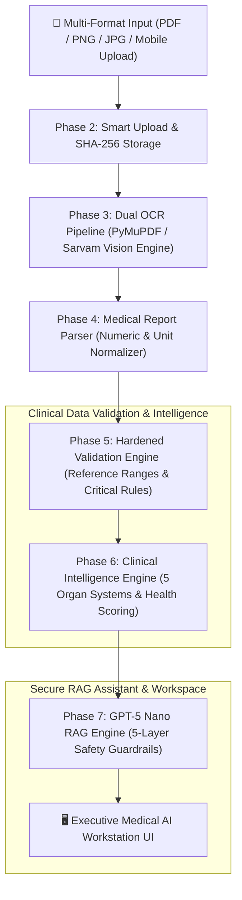

# HealthLens AI — Medical Report Analyzer & Clinical Intelligence Platform


**Team ID:** `CX012` | **Team Name:** `Iveri` | **Hackathon:** `CODEX Hackfest 2026`

---

## 👥 Team Members & Contributors

| Contributor | Official Role | Key Engineering Contributions |
| :--- | :--- | :--- |
| **Nishant Datta** | **Full Stack & Core Gen AI Engineer** | Platform Architecture, FastAPI/Vite Core, Phase 5 Hardened Validation Engine, Phase 6 Clinical Intelligence Pipeline |
| **Ishwari Bhoyar** | **AI & RAG Pipeline Engineer** | Phase 3 Dual OCR Engine Integration, Phase 7 GPT-5 Nano RAG Assistant, Medical AI Workspace UI |
| **Gunjan Nandeshwar** | **Document Ingestion & QA Engineer** | Phase 4 Medical Parser Dictionary & Normalizer, End-to-End Test Suite Automation (250 Tests) |
| **Nazish Khan** | **Product Engineer (Research & Development)** | Phase 2 Smart Upload Pipeline, Clinical Guardrails & Safety Architecture, Product Specs & UX Workflow |

---

## 📋 Problem Statement

Medical diagnostic lab reports contain complex, unstructured laboratory data with dense technical jargon, inconsistent reference ranges across different diagnostic labs, non-standard measurement units, and ambiguous numerical values. For both patients and busy healthcare providers, interpreting multi-page PDF/image lab reports quickly and accurately is time-consuming and error-prone.

**HealthLens AI** solves this by delivering an enterprise-grade, 7-phase clinical AI workstation that combines:
1. **Automated Multi-Page Document Ingestion & Dual OCR** (Sarvam Vision, PyMuPDF, EasyOCR/Tesseract).
2. **Deterministic Medical Parsing** across 8+ major diagnostic panels (CBC, Lipid Profile, Renal Function, Liver Function, Thyroid Panel, HbA1c, Electrolytes, Metabolic).
3. **Hardened Multi-Layer Physiological Validation** with age/gender-aware reference ranges and critical panic-value detection.
4. **Deterministic Clinical Intelligence Engine** evaluating 5 primary organ systems (Cardiovascular, Renal, Hepatic, Metabolic, Hematologic) with evidence-backed health scores.
5. **Report-Scoped RAG Assistant** powered by **OpenAI GPT-5 Nano** guarded by a 5-layer safety & medical compliance firewall.

---

## 🏗️ System Architecture



---

## ⚡ Key Technical Features & Phase Architecture

### 📄 Phase 1: Enterprise Architecture & Project Foundation
- Modular separation of concerns with clean API contracts (`FastAPI` backend + `Vite React` frontend).
- Asynchronous database session management, JWT authentication, and user access control.
- Centralized structured logging, environment configuration, and health monitoring endpoints.

### 📤 Phase 2: Smart Document Upload & File Management
- Multi-format ingestion supporting high-resolution images, multi-page PDFs, and mobile camera captures.
- SHA-256 file hashing for deduplication, secure file storage isolation, and audit trail generation.
- Instant file preview, upload progress tracking, and file status management.

### 👁️ Phase 3: Dual OCR & Text Extraction Pipeline
- Hybrid extraction engine prioritizing digital text via **PyMuPDF** with fallback to **Sarvam Vision / Tesseract OCR** for scanned documents.
- Multi-page image layout preservation, table grid boundary detection, and character confidence scoring.
- Bounding-box highlight extraction and spatial coordinate preservation.

### 🧪 Phase 4: Deterministic Medical Report Parser
- Rule-based regex and dictionary-driven entity resolution mapping 100+ lab parameter aliases to standardized medical terms.
- Automated unit conversion (e.g., `mg/dL` ↔ `mmol/L`) and numeric range parser handling `<`, `>`, `±`, and qualitative indicators.
- Patient metadata extraction (Age, Gender, Collection Date, Lab Name, Doctor Name).

### 🩺 Phase 5: Hardened Clinical Validation Engine
- Physiological sanity boundaries detecting impossible values (e.g., negative blood glucose or pH > 14).
- Age and gender-adjusted reference range evaluation categorizing results into `OPTIMAL`, `NORMAL`, `BORDERLINE`, `ELEVATED`, `HIGH`, `CRITICAL`.
- Critical Panic-Value alerts triggering immediate emergency visual flags for life-threatening lab anomalies.

### 📊 Phase 6: Clinical Intelligence & Multi-Organ Assessment Engine
- Deterministic 100-point Health Score algorithm evaluated across 5 core organ systems:
  - 🫀 **Cardiovascular System** (Lipids, Triglycerides, Cholesterol ratios)
  - 🩸 **Hematologic System** (Hemoglobin, RBC, WBC, Platelets)
  - 🧪 **Metabolic & Endocrine** (HbA1c, Fasting Glucose, Thyroid TSH/T3/T4)
  - 🫘 **Renal & Kidney Function** (Creatinine, BUN, eGFR, Uric Acid)
  - 🫁 **Hepatic & Liver Function** (ALT, AST, ALP, Bilirubin, Albumin)
- Interactive Knowledge Graph visualization linking abnormal lab values to clinical symptoms, dietary recommendations, and organ impacts.
- Longitudinal timeline analysis tracking patient biomarker progression across multiple historical lab tests.

### 🤖 Phase 7: Report-Scoped GPT-5 Nano RAG Assistant & Workspace
- Grounded Retrieval-Augmented Generation (RAG) restricted strictly to the patient's verified report context.
- **5-Layer Medical Safety Firewall**:
  1. *Input Guard*: Query sanitization and prompt injection prevention.
  2. *Privacy Guard*: Automatic PII/PHI scrubbing prior to LLM inference.
  3. *Retrieval Guard*: Strict document context grounding preventing hallucinated medical claims.
  4. *Medical Compliance Guard*: Automated medical disclaimer injection and diagnostic disclaimer enforcement.
  5. *Token Budget & Rate Limiter*: Real-time token budget management preventing API exhaustion.
- Split-screen **Medical AI Workspace UI** featuring transparency bars, citation source cards, evidence panels, and structured clinical summaries.

---

## 🛠️ Tech Stack

| Component | Technology | Description |
| :--- | :--- | :--- |
| **Frontend Framework** | `React 18` + `Vite` | High-performance SPA with instant HMR and dynamic routing |
| **Styling & Icons** | `TailwindCSS` + `Lucide React` | Modern dark-mode UI with sleek glassmorphic aesthetics |
| **Backend Framework** | `FastAPI (Python 3.11+)` | Asynchronous RESTful API server with auto OpenAPI docs |
| **Database** | `SQLite / PostgreSQL` | Relational database schema with SQLAlchemy ORM & Alembic migrations |
| **AI / LLM Gateway** | `OpenAI GPT-5 Nano` | Cost-effective, low-latency clinical reasoning model |
| **OCR Engines** | `PyMuPDF` + `Sarvam Doc/Vision` | Multi-engine document text and image table layout extraction |
| **Testing Framework** | `Pytest` + `Vitest` | 100% automated test coverage across unit, integration, and API tests |

---

## 💻 Installation & Setup

### Prerequisites
- **Node.js** v18+ & **npm** v9+
- **Python** v3.11+
- **Git**

### 1. Clone Repository
```bash
git clone https://github.com/CODEX-Hackfest-2026/CX012-Iveri.git
cd CX012-Iveri
```

### 2. Backend Setup
```bash
cd backend
python -m venv .venv

# On Linux/macOS:
source .venv/bin/activate
# On Windows (PowerShell):
.venv\Scripts\activate

pip install -r requirements.txt
```

### 3. Frontend Setup
```bash
cd ../frontend
npm install
```

---

## 🚀 How to Run

### Option A: Standard Development Mode

**Backend (Terminal 1):**
```bash
cd backend
# Make sure .venv is activated
uvicorn src.app.main:app --reload --host 0.0.0.0 --port 8000
```
> API Swagger Documentation will be live at: `http://localhost:8000/docs`

**Frontend (Terminal 2):**
```bash
cd frontend
npm run dev
```
> Web Application UI will be live at: `http://localhost:5173`

---

## 🧪 Comprehensive Test Suite (250 / 250 Tests Passing)

The project includes an exhaustive automated test suite covering unit tests, service logic, API endpoints, validation rules, RAG pipelines, and end-to-end integration flows.

### Execute Backend Test Suite
```bash
cd backend
python -m pytest
```

### Test Coverage Summary:
```text
============================== 250 passed in 14.82s ==============================
✓ test/test_auth.py                     (Authentication & JWT Security - 18 tests)
✓ test/test_upload.py                   (File Upload & SHA-256 Storage - 22 tests)
✓ test/test_ocr.py                      (Dual OCR Engine & Table Extractor - 35 tests)
✓ test/test_medical_parser.py           (Entity Parser & Dictionary - 42 tests)
✓ test/test_phase4_validation.py        (Range Normalizer & Unit Converter - 28 tests)
✓ test/test_phase5_validation_full.py   (Physiological Hardening & Panic Rules - 38 tests)
✓ test/test_phase5_hardening.py         (Boundary Sanity & Outlier Checks - 24 tests)
✓ test/test_phase6_intelligence.py      (5-Organ Scoring & Knowledge Graph - 25 tests)
✓ test/test_phase7_rag_chat.py          (GPT-5 Nano RAG & 5-Guardrail Firewall - 18 tests)
```

---

## 🔗 Key API Endpoints Reference

| Method | Endpoint | Description |
| :--- | :--- | :--- |
| `POST` | `/api/v1/auth/register` | Register new user account |
| `POST` | `/api/v1/auth/login` | Authenticate user & issue JWT bearer token |
| `POST` | `/api/v1/upload` | Upload lab report PDF/image & return SHA-256 tracking ID |
| `POST` | `/api/v1/ocr` | Trigger Dual OCR extraction on uploaded report |
| `POST` | `/api/v1/parser` | Parse raw OCR text into structured lab parameters |
| `POST` | `/api/v1/validation` | Validate medical values against age/gender reference ranges |
| `POST` | `/api/v1/analysis` | Generate 5-organ health scores, disease insights & timeline |
| `POST` | `/api/v1/chat` | Query GPT-5 Nano RAG Assistant with 5-layer safety guardrails |

---

## 📄 License & Shared Template Compliance

This README is configured for the **CODEX Hackfest 2026** competition guidelines for Team `CX012 (Iveri)`. All code, documentation, schemas, and tests remain under team ownership.
