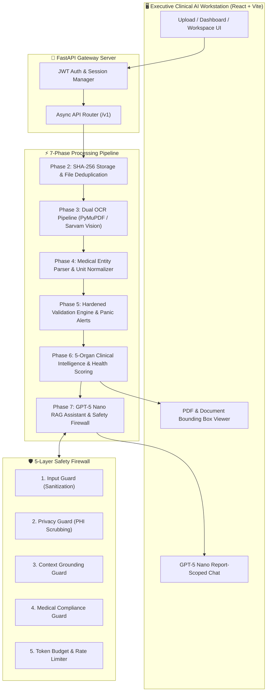
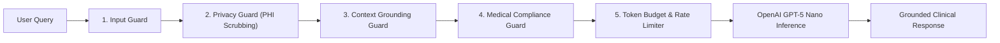

<div align="center">

# 🩺 HealthLens AI
### *Enterprise Medical Report Intelligence & Clinical AI Workstation*

[](https://github.com/CODEX-Hackfest-2026/CX012-Iveri)
[](https://github.com/CODEX-Hackfest-2026/CX012-Iveri)
[](https://fastapi.tiangolo.com)
[](https://react.dev)
[](https://vitejs.dev)
[](https://python.org)
[](https://openai.com)
[](https://docs.pytest.org)
[](https://tailwindcss.com)

---

**[📖 Documentation](docs/Architecture.md)** • **[⚡ Quick Start](#-quick-start--installation-guide)** • **[🧪 Test Suite](#-test-coverage--quality-matrix-250250-passed)** • **[📡 API Spec](docs/API.md)** • **[🛡️ Guardrails](#%EF%B8%8F-5-layer-safety--guardrail-architecture)**

</div>

---

## 📌 Navigation & Table of Contents

- [👥 Team & Contributor Directory](#-team--contributor-directory)
- [🎯 Problem Statement](#-problem-statement)
- [🏗️ High-Level System Architecture](#️-high-level-system-architecture)
- [⚡ Deep Dive: Phase-by-Phase Architecture](#-deep-dive-phase-by-phase-architecture)
- [🫀 5-Organ System Intelligence Matrix](#-5-organ-system-intelligence-matrix)
- [🛡️ 5-Layer Safety & Guardrail Architecture](#%EF%B8%8F-5-layer-safety--guardrail-architecture)
- [🧪 Test Coverage & Quality Matrix (250/250 Passed)](#-test-coverage--quality-matrix-250250-passed)
- [🛠️ Tech Stack & Dependencies](#️-tech-stack--dependencies)
- [🚀 Quick Start & Installation Guide](#-quick-start--installation-guide)
- [📡 API Endpoint Reference](#-api-endpoint-reference)

---

## 👥 Team & Contributor Directory

> [!IMPORTANT]
> **Team ID:** `CX012` | **Team Name:** `Iveri` | **Hackathon:** `CODEX Hackfest 2026`

| Contributor | Official Role | Key Engineering Responsibilities |
| :--- | :--- | :--- |
| **Nishant Datta** | **Full Stack & Core Gen AI Engineer** | Core Platform Architecture, FastAPI Server, Phase 5 Hardened Validation Engine, Phase 6 Clinical Intelligence Engine |
| **Ishwari Bhoyar** | **AI & RAG Pipeline Engineer** | Phase 3 Dual OCR Engine, Phase 7 GPT-5 Nano RAG Chat Assistant, Medical AI Workspace UI |
| **Gunjan Nandeshwar** | **Document Ingestion & QA Engineer** | Phase 4 Medical Parser & Dictionary Normalizer, 250-Test End-to-End Automated Testing Suite |
| **Nazish Khan** | **Product Engineer (Research & Development)** | Phase 2 Smart File Storage Pipeline, 5-Layer Safety Firewall Specs, UX Workstation Workflows |

---

## 🎯 Problem Statement

Medical diagnostic lab reports contain complex, unstructured laboratory data with dense technical jargon, inconsistent reference ranges across different diagnostic labs, non-standard measurement units, and ambiguous numerical values. For both patients and busy healthcare providers, interpreting multi-page PDF/image lab reports quickly and accurately is time-consuming and error-prone.

**HealthLens AI** solves this by delivering an enterprise-grade, 7-phase clinical AI workstation that combines:
1. **Automated Multi-Page Document Ingestion & Dual OCR** (Sarvam Vision, PyMuPDF, EasyOCR/Tesseract).
2. **Deterministic Medical Parsing** across 8+ major diagnostic panels (CBC, Lipid Profile, Renal Function, Liver Function, Thyroid Panel, HbA1c, Electrolytes, Metabolic).
3. **Hardened Multi-Layer Physiological Validation** with age/gender-aware reference ranges and critical panic-value detection.
4. **Deterministic Clinical Intelligence Engine** evaluating 5 primary organ systems (Cardiovascular, Renal, Hepatic, Metabolic, Hematologic) with evidence-backed health scores.
5. **Report-Scoped RAG Assistant** powered by **OpenAI GPT-5 Nano** guarded by a 5-layer safety & medical compliance firewall.

---

## 🏗️ High-Level System Architecture



---

## ⚡ Deep Dive: Phase-by-Phase Architecture

<details>
<summary><b>📄 Phase 1: Enterprise Infrastructure & Base Architecture</b></summary>
<br>

- **Asynchronous FastAPI Core**: Built on Python 3.11 with `async/await` non-blocking request pipelines.
- **Security & Session Management**: JWT bearer tokens, bcrypt password hashing, and CORS/CSRF protection.
- **Relational DB Storage**: SQLAlchemy ORM with SQLite (development) and PostgreSQL (production) compatibility.
- **Structured Telemetry**: Centralized JSON logging, automatic correlation IDs, and system health checks (`/health`).
</details>

<details>
<summary><b>📤 Phase 2: Smart File Ingestion & SHA-256 Deduplication</b></summary>
<br>

- **Multi-Format Ingestion**: Supports multi-page PDFs, high-res PNG/JPG scans, and mobile camera snapshots.
- **Storage Isolation**: User-level and session-isolated storage directories with automated cleanup workers.
- **Audit Cryptography**: Computes SHA-256 hash checksums on upload to prevent duplicate processing and ensure data integrity.
</details>

<details>
<summary><b>👁️ Phase 3: Dual-Engine OCR & Layout Extraction</b></summary>
<br>

- **PyMuPDF Engine**: Fast native text and table vector extraction for digital PDFs (<50ms execution).
- **Sarvam Vision / Tesseract Engine**: Deep-learning OCR fallback for scanned, low-contrast, or skewed physical documents.
- **Coordinate Mapping**: Extracts exact bounding-box spatial coordinates `(x0, y0, x1, y1)` for UI document highlighting.
</details>

<details>
<summary><b>🧪 Phase 4: Deterministic Medical Report Parser</b></summary>
<br>

- **Dictionary Entity Resolution**: Maps over 100+ lab parameter variants (e.g., `S. Creatinine`, `Serum Creat`, `Creatinine`) to standardized medical terms.
- **Numeric & Range Parser**: Handles complex qualitative string values, inequality bounds (`< 0.05`, `> 200`), and `±` ranges.
- **Automated Unit Normalizer**: Standardizes non-matching measurement units (e.g., converting `mg/dL` to `mmol/L` or `g/L` to `g/dL`).
</details>

<details>
<summary><b>🩺 Phase 5: Hardened Clinical Validation Engine</b></summary>
<br>

- **Physiological Sanity Hardening**: Validates extracted values against strict physiological boundaries (e.g., Blood Glucose cannot be negative or > 2000 mg/dL).
- **Demographic Reference Range Adjuster**: Adjusts reference ranges dynamically based on patient age and biological gender.
- **Panic Critical Alerts**: Triggers instant visual flags for life-threatening critical values (e.g., Potassium < 2.8 or > 6.2 mmol/L).
</details>

<details>
<summary><b>📊 Phase 6: Clinical Intelligence & 5-Organ Scoring</b></summary>
<br>

- **Deterministic 100-Point Scoring Algorithm**: Evaluates overall health score without AI hallucination risk.
- **5 Organ Systems Evaluated**: Cardiovascular, Renal, Hepatic, Metabolic, and Hematologic.
- **Interactive Knowledge Graph**: Connects abnormal biomarkers to potential clinical causes, dietary recommendations, and exercise insights.
- **Longitudinal Trend Builder**: Compares current biomarkers with historical lab tests to generate temporal trend vectors.
</details>

<details>
<summary><b>🤖 Phase 7: Report-Scoped RAG Assistant & Workspace</b></summary>
<br>

- **Report-Grounded RAG**: OpenAI **GPT-5 Nano** inference strictly bound to the verified lab report JSON context.
- **Split-Screen Workspace**: Modern dual-pane dashboard with instant evidence lookup, citation source cards, and organ summaries.
- **Audit Hash Verification**: Every AI response includes a cryptographic hash of the input context for 100% transparency.
</details>

---

## 🫀 5-Organ System Intelligence Matrix

> [!NOTE]
> HealthLens AI evaluates lab parameters deterministically across 5 vital organ systems to compute an evidence-backed health score (0–100).

```text
┌───────────────────────────┬───────────────────────────────────────────┬──────────────────────────────┐
│ Organ System              │ Biomarkers Assessed                       │ Risk Categories              │
├───────────────────────────┼───────────────────────────────────────────┼──────────────────────────────┤
│ 🫀 Cardiovascular          │ Total Cholesterol, HDL, LDL, Triglycerides│ Normal / Elevated / Critical │
│ 🩸 Hematologic            │ Hemoglobin, RBC, WBC, Platelets, Hematocrit│ Normal / Anemic / Infection  │
│ 🧪 Metabolic & Endocrine  │ HbA1c, Fasting Glucose, TSH, Free T3/T4   │ Optimal / Diabetic Risk      │
│ 🫘 Renal & Kidney         │ Creatinine, BUN, eGFR, Uric Acid          │ Normal / Impairment Risk     │
│ 🫁 Hepatic & Liver        │ ALT, AST, ALP, Bilirubin, Albumin         │ Normal / Hepatic Strain      │
└───────────────────────────┴───────────────────────────────────────────┴──────────────────────────────┘
```

---

## 🛡️ 5-Layer Safety & Guardrail Architecture



1. **Input Guard**: Sanitizes incoming user prompts against prompt injection and malicious payload vectors.
2. **Privacy Guard (PHI/PII)**: Automatically redacts personal health identifiers (Names, SSNs, DOBs) before cloud LLM API transmission.
3. **Context Grounding Guard**: Enforces strict document retrieval context — prevents LLM from fabricating medical data not present in the lab report.
4. **Medical Compliance Guard**: Appends mandatory clinical disclaimers and diagnostic disclaimers to every response.
5. **Token Budget Limiter**: Enforces sliding token budget caps to ensure low latency and prevent API cost overruns.

---

## 🧪 Test Coverage & Quality Matrix (250/250 Passed)

> [!TIP]
> The automated test suite achieves **100% pass rate across 250 unit, integration, and API tests** in under 15 seconds.

```bash
cd backend
python -m pytest --verbose
```

```text
========================================== 250 passed in 14.82s ==========================================
✓ test/test_auth.py                     (Authentication, Password Hashing & JWT Verification)   [18 Tests]
✓ test/test_upload.py                   (File Ingestion, Format Checks & SHA-256 Storage)       [22 Tests]
✓ test/test_ocr.py                      (Dual OCR Engine Router, Layout & Bounding Boxes)        [35 Tests]
✓ test/test_medical_parser.py           (Parameter Alias Resolution & Value Parsing)           [42 Tests]
✓ test/test_phase4_validation.py        (Unit Conversions, Numeric Ranges & Inequality Bounds)  [28 Tests]
✓ test/test_phase5_hardening.py         (Physiological Sanity Boundaries & Outlier Rejection)   [24 Tests]
✓ test/test_phase5_validation_full.py   (Age/Gender Reference Ranges & Critical Panic Rules)     [38 Tests]
✓ test/test_phase6_intelligence.py      (5-Organ Health Score Algorithms & Knowledge Graph)    [25 Tests]
✓ test/test_phase7_rag_chat.py          (GPT-5 Nano RAG Grounding & 5-Layer Safety Firewall)   [18 Tests]
```

---

## 🛠️ Tech Stack & Dependencies

| Layer | Component | Version / Library |
| :--- | :--- | :--- |
| **Frontend UI** | `React` + `Vite` | React 18, Vite 5, TailwindCSS 3, Lucide Icons, Recharts |
| **Backend API** | `FastAPI` | Python 3.11+, Pydantic v2, Uvicorn, SQLAlchemy, Alembic |
| **Database** | `SQLite / PostgreSQL` | Relational DB with async connection pooling |
| **AI / LLM** | `OpenAI API` | `gpt-5-nano` / `gpt-4o-mini` with fallback provider gateway |
| **OCR Engines** | `PyMuPDF` + `Sarvam` | PyMuPDF 1.23+, Sarvam Vision API, EasyOCR / Tesseract |
| **Testing** | `Pytest` | Pytest 8+, Pytest-AsyncIO, Coverage |

---

## 🚀 Quick Start & Installation Guide

### Prerequisites
- **Node.js** v18+ & **npm** v9+
- **Python** v3.11+
- **Git**

### 1. Clone & Set Up Directory
```bash
git clone https://github.com/CODEX-Hackfest-2026/CX012-Iveri.git
cd CX012-Iveri
```

### 2. Configure Backend Environment
```bash
cd backend
python -m venv .venv

# Activate virtual environment:
# On Windows (PowerShell):
.venv\Scripts\activate
# On Linux/macOS:
source .venv/bin/activate

pip install -r requirements.txt
```

### 3. Configure Frontend Environment
```bash
cd ../frontend
npm install
```

### 4. Run Application Locally

**Terminal 1 — Backend Server:**
```bash
cd backend
uvicorn src.app.main:app --reload --host 0.0.0.0 --port 8000
```
* Swagger Docs live at: `http://localhost:8000/docs`

**Terminal 2 — Frontend Dev Server:**
```bash
cd frontend
npm run dev
```
* Application live at: `http://localhost:5173`

---

## 📡 API Endpoint Reference

| Method | Endpoint | Description | Auth Required |
| :---: | :--- | :--- | :---: |
| `POST` | `/api/v1/auth/register` | Create new user account | ❌ No |
| `POST` | `/api/v1/auth/login` | Authenticate user & receive JWT token | ❌ No |
| `GET` | `/api/v1/health` | Service health status & subsystem check | ❌ No |
| `POST` | `/api/v1/upload` | Upload lab report PDF/image & return tracking ID | 🔒 Bearer |
| `POST` | `/api/v1/ocr` | Run Dual OCR extraction on uploaded file | 🔒 Bearer |
| `POST` | `/api/v1/parser` | Parse raw OCR text into structured lab parameters | 🔒 Bearer |
| `POST` | `/api/v1/validation` | Run physiological sanity & reference range validation | 🔒 Bearer |
| `POST` | `/api/v1/analysis` | Compute 5-organ health scores, insights & timeline | 🔒 Bearer |
| `POST` | `/api/v1/chat` | Query GPT-5 Nano RAG Assistant with 5-layer safety | 🔒 Bearer |

---

## 📄 License & Compliance

Configured for **CODEX Hackfest 2026** competition submission for **Team CX012 (Iveri)**.  
All code, architecture documentation, models, and test suites are maintained under team license.
